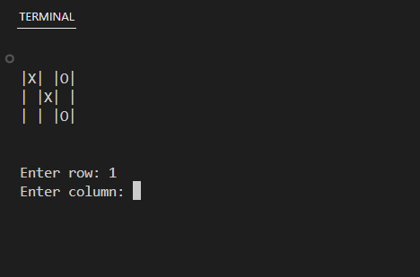

# Tic-tac-toe

## A Tic-tac-toe game built in Python using OOP
This is a Tic-tac-toe game built in Python. It uses Object Oriented Programming
to represent the game as a class called "TicTacToe". To play the game the class
can be instantiated as an object, and then the main loop method can be called.

To understand the logic behind the game please see pseudocode.py.

## Demo

## Instructions
Clone the git repo and run main.py.